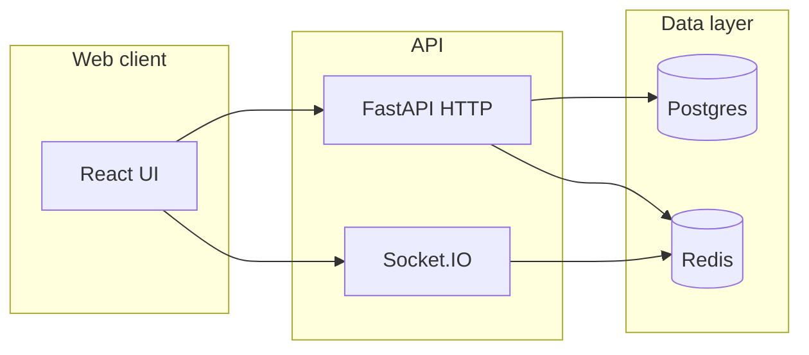

# BrainBolt architecture

This document describes how the quiz engine works, why it is shaped this way, and how clients should integrate.

## Goals

- **Single active question per user** at a time, assigned by the server.
- **No repeat questions** for a user: each `(user_id, question_id)` is answered at most once (enforced in the database).
- **Adaptive difficulty**: climb when the user succeeds, ease when they miss, prefer harder eligible tiers when stock allows, fall back to easier tiers when not.
- **Safe under concurrency**: multiple tabs or double-clicks must not corrupt score or show inconsistent state (optimistic concurrency via `stateVersion`).

## High-level system

- **Postgres** is the source of truth for users, questions, per-user state, answer history, and uniqueness rules.
- **Redis** holds idempotency keys, sorted-set leaderboards, question buffers, lightweight “seen” windows, and optional user-state cache.

## Data model (quiz-relevant)

| Table / concept | Role |
|-----------------|------|
| `questions` | Bank of items with intrinsic `difficulty` (1–10), used for **scoring** and tagging. |
| `user_state` | One row per user: `current_difficulty` (adaptive band), `current_question_id`, streak, totals, **`state_version`**. |
| `answer_log` | One row **per user per question** (`UNIQUE(user_id, question_id)`). Stores correctness, deltas, idempotency key. **Eligibility** for `/next` is “no row here yet.” |
| Leaderboards in Redis | Sorted sets for score and streak; updated after successful commits. |

Legacy `user_question_mastery` was removed; `answer_log` is the single truth for “has this user finished this card?”

## End-to-end flows

### `GET /v1/quiz/next`

1. Load `user_state` with `SELECT … FOR UPDATE`.
2. Apply streak decay if `last_answer_at` is old enough (configurable).
3. Resolve the active question:
   - If `current_question_id` still points at a never-attempted question, return it **without** bumping `state_version` (idempotent re-fetch).
   - Otherwise pick a new question: Redis buffer + DB fallbacks, excluding attempted IDs and applying “seen” heuristics.
4. When a **new** assignment happens, set `current_question_id`, bump **`state_version`**, commit, invalidate metrics cache.

The JSON response includes:

- `difficulty`: intrinsic question tier (scoring).
- `userDifficulty`: `user_state.current_difficulty` after assignment (adaptive band). These may differ when the pool forces a different tier than the ideal band.

### `POST /v1/quiz/answer`

1. Optional: return cached body if Redis idempotency key matches.
2. Validate `stateVersion` and `questionId` against **`current_question_id`** and **`state_version`** (409 on mismatch).
3. Reserve **`answer_log`** with `INSERT … ON CONFLICT (user_id, question_id) DO NOTHING RETURNING …`. If no row inserted → **409** `question_already_mastered` (already answered that card).
4. Compute outcome (streak, score delta, new adaptive difficulty).
5. Commit; optionally broadcast leaderboard over Socket.IO.

**Correct answers** bump adaptive difficulty with `next_difficulty_on_correct` from the **card’s** difficulty.

**Wrong answers** lower adaptive difficulty from **`user_state.current_difficulty`**, stepping down only into tiers that still have never-attempted stock **after** this answer is logged (the current card is excluded from that “future pool” check).

### Difficulty selection for the next card

Selection is implemented in `_choose_available_difficulty` (see `quiz_service.py`):

- First-ever question (`answered_count == 0`): easiest eligible tier ≥ adaptive band (gentle onboarding).
- After a **miss** (`streak == 0` and the adaptive band still has eligible cards): stay on that band until exhausted.
- Otherwise: prefer the **hardest** eligible tier in `[base, base+1]`; if that window is empty, jump to the **lowest** tier still above `base+1` (fills holes in the ladder). If nothing is ≥ base, take the **hardest** tier below base.

DB widening when the buffer fails uses the adaptive target first, then remaining tiers **hardest-first** among eligible.

## Optimistic concurrency: `stateVersion`

- Every **new** question assignment increments `state_version`.
- Each **answer** increments `state_version` as part of the same transaction as the log row.
- The client must send the **`stateVersion` from the current question payload** with the answer.

**409 `state_version_conflict`** means the client is stale (e.g. another tab, or a duplicate submit). Clients should **re-call `/next` (and metrics)** to resync.

The React app uses a synchronous **in-flight guard** (ref) so two clicks in the same frame cannot send two answers.

## Operational notes

- **Migrate + seed** run on container start (`docker compose` command in `docker-compose.yml`).
- Tests use in-memory SQLite + `fakeredis`; production uses Postgres + Redis.
- Environment variables are read in `app/config.py` (database URL, Redis URL, scoring tuning, CORS, etc.).

## File map (backend)

| Area | Location |
|------|-----------|
| HTTP routes | `app/http/routes_quiz.py`, `routes_leaderboard.py` |
| Quiz orchestration | `app/services/quiz_service.py` |
| Scoring rules | `app/core/scoring.py` |
| Models | `app/db/models.py` |
| Migrate / seed | `app/db/migrate.py`, `app/db/seed.py` |
